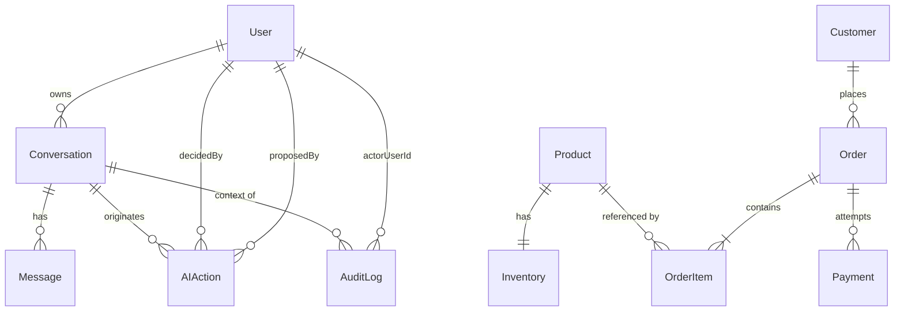
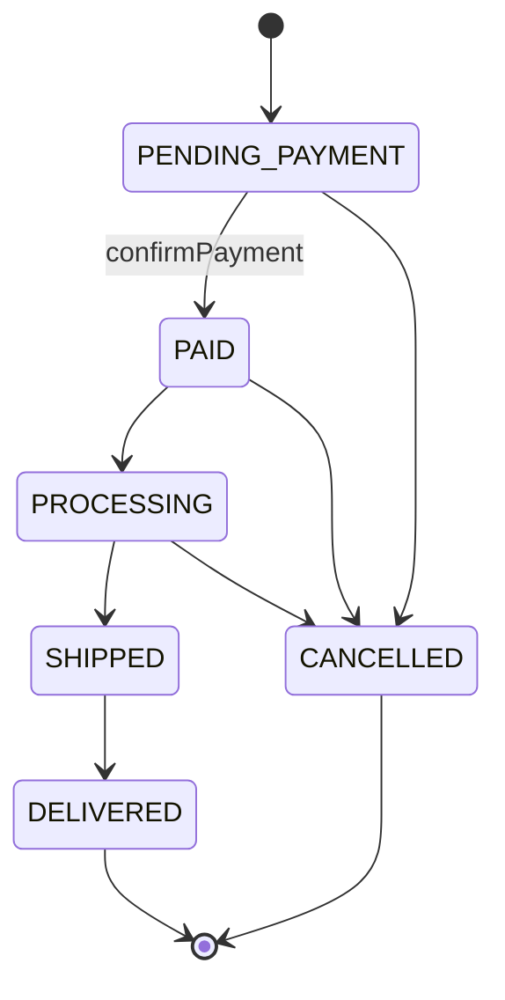
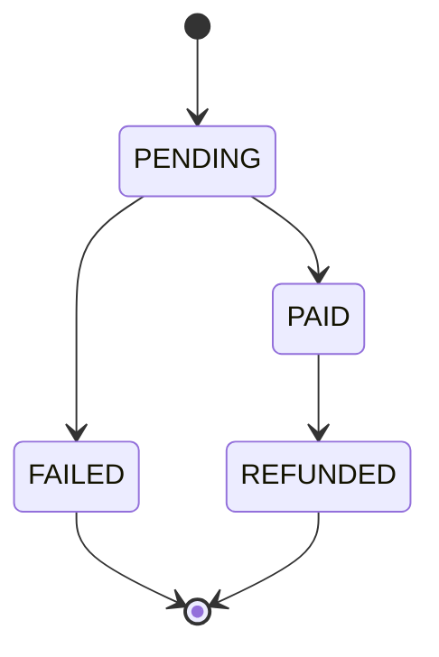
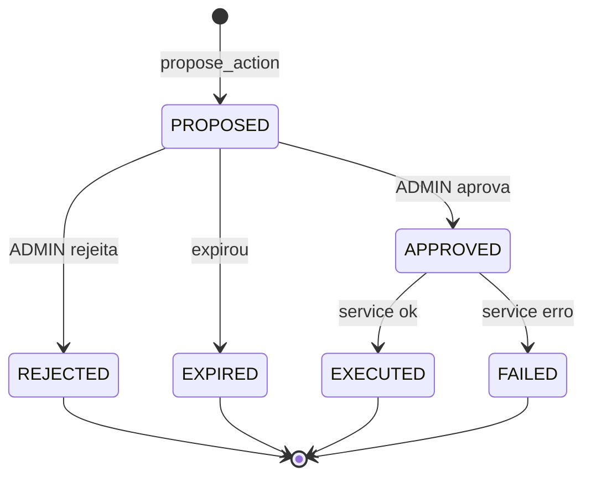

# Domínio — AI Business Operations Platform

> Linguagem ubíqua do projeto: entidades, relações, máquinas de estado, regras de negócio parametrizadas, glossário e eventos futuros. Todo agente implementa **este** vocabulário; se algo aqui estiver errado, corrige-se aqui primeiro.
>
> Status: **Aprovado pelo PO (aguardando merge)** — 2026-09-09 | Owner: solution-architect | Revisores: product-manager e reviewer (APROVADO COM AJUSTES; ajustes aplicados) | Data: 2026-09-09
> História: [H00.1 — Documento de domínio](./roadmap.md) | Base: [Lean Inception §4, §5, §10](./lean-inception.md), [Discovery §7-10](./discovery.md), [PROJECT_PLAN §6, §15](../PROJECT_PLAN.md), [ADR-003](./adr/003-ai-tool-boundary.md), [ADR-004](./adr/004-authentication-and-roles.md), [ADR-006](./adr/006-human-in-the-loop-policy.md)

Convenções deste documento: nomes de código em inglês; tipos são **conceituais** (`string`, `int`, `decimal`, `datetime`, `date`, `boolean`, `enum`, `json`), não schema Prisma. `*` marca atributo obrigatório. Todas as entidades têm `id: string (cuid)`, `createdAt` e `updatedAt`, omitidos nas tabelas (exceto `AuditLog`, que não tem `updatedAt`). Onde este documento divergir da Lean Inception, **este documento prevalece**.

---

## 1. Visão geral e contextos

O sistema é um monólito modular ([ADR-001](./adr/001-modular-monolith.md)). O domínio é dividido em contextos que viram módulos em `src/modules/*`. Cada contexto é dono de suas entidades; outros contextos só as acessam por application services públicos.

| Contexto (módulo) | Entidades | Responsabilidade |
|---|---|---|
| `identity` | `User` | Quem usa o sistema e com qual papel ([ADR-004](./adr/004-authentication-and-roles.md)). |
| `customers` | `Customer` | Quem compra. |
| `products` | `Product`, `Inventory` | Catálogo e estoque. Regra de estoque baixo. |
| `orders` | `Order`, `OrderItem` | Centro do domínio. Máquina de estados do pedido, prioridade, cálculo de total, **motor de regras de atenção**, casos de uso `confirmPayment` e `cancelOrder` (orquestram `payments`). |
| `payments` | `Payment` | Tentativas de pagamento (simuladas) e seus estados. |
| `assistant` | `Conversation`, `Message`, `AIAction` | Persistência da conversa com o assistente e das propostas de ação de alto impacto. É um módulo de domínio comum, com repositórios e application services (`ConversationService`, `AIActionService`). |
| `audit` | `AuditLog` | Trilha append-only de tudo que altera estado ou executa tool. |

**`assistant` (módulo de domínio) ≠ `src/ai/**` (camada de orquestração).** `src/ai` contém system prompts, tool registry, schemas e a chamada ao provedor; **não persiste nada** e não importa Prisma nem repositórios (ADR-003). Quando uma tool precisa gravar (`propose_action`) ou o chat precisa salvar mensagens, chama o application service de `assistant`. A estrutura de pastas definitiva é fixada em `architecture.md` (H00.2).

Dependências permitidas entre contextos:

| De → Para | Tipo | Como |
|---|---|---|
| `orders` → `customers`, `products` | leitura | Application services públicos (`CustomerService`, `ProductService`). Nenhuma escrita em `Inventory` no MVP. |
| `orders` → `payments` | leitura **e escrita** | `PaymentService.markPaid` e `PaymentService.markRefunded`, chamados pelos casos de uso `confirmPayment` (§4.6) e `cancelOrder` (§3.1) dentro da mesma transação. `orders` nunca toca na tabela de `Payment`. |
| `orders` → `audit` | leitura | Histórico do pedido (§2.5). |
| `assistant` → `orders` | escrita via service | `AIActionService.approve` executa `OrderService.cancel` após aprovação. Único ponto em que `assistant` invoca escrita fora de tool. |
| `src/ai` → qualquer módulo | **somente via tool → application service** | ADR-003. |
| todos → `audit` | escrita | `AuditService.record`. `audit` não depende de ninguém. |
| todos → `identity` | leitura | Usuário da sessão. |

---

## 2. Entidades

### 2.1 `User` (identity)

Pessoa autenticada. Papéis mínimos para sustentar J1/J2: quem opera (`OPERATOR`) e quem aprova (`ADMIN`).

| Atributo | Tipo | Notas |
|---|---|---|
| `email` * | string, único | Login. |
| `name` * | string | |
| `passwordHash` * | string | Nunca exposto em API, tool ou log. |
| `role` * | enum `Role { OPERATOR, ADMIN }` | `ADMIN` herda tudo de `OPERATOR` e ainda decide `AIAction` e lê qualquer `Conversation`. |
| `active` * | boolean, default `true` | Usuário inativo não autentica. |

Relações: 1 `User` → N `Conversation`; 1 `User` → N `AIAction` (como `proposedByUserId`) e N `AIAction` (como `decidedByUserId`); 1 `User` → N `AuditLog` (como `actorUserId` ou `onBehalfOfUserId`).

Invariantes: `email` único; nunca deletar (desativar), pois `AuditLog` referencia.

### 2.2 `Customer` (customers)

Comprador da loja. Sem endereço no MVP: não há logística real, e o estado de envio é suficiente para as jornadas.

| Atributo | Tipo | Notas |
|---|---|---|
| `name` * | string | Conteúdo do usuário: tratado como dado, nunca como instrução (prompt injection). |
| `email` * | string, único | Busca em H06.1. |
| `phone` | string | |

Relações: 1 `Customer` → N `Order` (um `Order` pertence a exatamente 1 `Customer`).

Derivados (não persistidos): `totalSpent` = Σ `Order.total` com `status ∈ {PAID, PROCESSING, SHIPPED, DELIVERED}`; `ordersCount`.

### 2.3 `Product` (products)

Item do catálogo. `category` é `string` livre, não entidade: o MVP só filtra e exibe; uma entidade `Category` seria tabela sem regra.

| Atributo | Tipo | Notas |
|---|---|---|
| `sku` * | string, único | Identificador legível. |
| `name` * | string | Conteúdo do usuário. |
| `description` | string | Conteúdo do usuário. |
| `category` * | string | |
| `price` * | decimal(12,2) ≥ 0 | Preço atual de venda. O preço do pedido é snapshot em `OrderItem.unitPrice`. |
| `active` * | boolean, default `true` | Produto inativo não é vendido, mas continua referenciado por pedidos antigos. |

Relações: 1 `Product` → 1 `Inventory` (obrigatório, 1:1); 1 `Product` → N `OrderItem`.

Invariantes: nunca deletar (desativar); `sku` único.

### 2.4 `Inventory` (products)

Posição de estoque de um produto. **Decisão:** entidade separada 1:1 com `Product`, e não campos em `Product`. Motivo: separa catálogo (muda raramente) de estoque (muda a cada venda), isola a regra de estoque baixo e permite evoluir para múltiplos depósitos sem tocar em `Product`. Custo: um join a mais.

| Atributo | Tipo | Notas |
|---|---|---|
| `productId` * | string, único | 1:1. |
| `available` * | int ≥ 0 | Unidades vendáveis agora. |
| `minimum` * | int ≥ 0 | Limite abaixo do qual o estoque é considerado baixo. |

Fora do MVP (decisão do PO, §9): reserva de estoque para pedidos pagos e não enviados. Entra em V2 junto com o evento `OrderPaid` (§7).

Relações: 1 `Inventory` → 1 `Product`.

Derivados: `isLowStock` = regra §4.2.

### 2.5 `Order` (orders)

Pedido de compra. Raiz de agregado de `OrderItem`.

| Atributo | Tipo | Notas |
|---|---|---|
| `orderNumber` * | int, único, sequencial | Número legível exibido como `#1023`. **Distinto do `id`**: o `id` é técnico (cuid); a IA, a UI e as pessoas usam `orderNumber`. Tools aceitam `#1023` ou `1023`. |
| `customerId` * | string | |
| `status` * | enum `OrderStatus` (§3.1) | |
| `priority` * | enum `OrderPriority { NORMAL, HIGH }`, default `NORMAL` | Enum e não boolean: filtro/badge legíveis e extensível (ex.: `URGENT`) sem mudar a semântica. "Marcar prioridade" = `HIGH`; "desmarcar" = `NORMAL`. Regra em §4.4. |
| `subtotal` * | decimal(12,2) | Σ `OrderItem.lineTotal`. |
| `shippingFee` * | decimal(12,2) ≥ 0, default `0` | |
| `discount` * | decimal(12,2) ≥ 0, default `0` | |
| `total` * | decimal(12,2) ≥ 0 | Regra §4.3. |
| `placedAt` * | datetime | Momento do pedido. Igual a `createdAt` em produção; separado para que o seed possa datar pedidos no passado sem falsear `createdAt`. As regras de tempo usam `placedAt`. |
| `paidAt` | datetime | Preenchido em `confirmPayment` (§4.6). |
| `expectedShipDate` | date | Definido em `confirmPayment` como `today(paidAt) + SHIPPING_SLA_DAYS` (dias corridos, timezone de negócio §4.1). Base da regra `SHIPPING_DELAYED`. |
| `shippedAt` | datetime | Preenchido em → `SHIPPED`. |
| `deliveredAt` | datetime | Preenchido em → `DELIVERED`. |
| `cancelledAt` | datetime | Preenchido em → `CANCELLED`. |
| `cancellationReason` | string | Obrigatório quando `status = CANCELLED`. Quando o cancelamento vem de uma `AIAction`, é **igual a `AIAction.reason`**; o id da proposta fica em `AuditLog.input.aiActionId` do registro `order.cancelled` (sem coluna em `Order`, para `orders` não depender de `assistant`). `decisionNote` do aprovador fica só na proposta. |

Relações: N `Order` → 1 `Customer`; 1 `Order` → N `OrderItem` (mínimo 1); 1 `Order` → N `Payment` (zero ou mais tentativas).

Invariantes:
- Pelo menos 1 `OrderItem`.
- `total = subtotal + shippingFee − discount ≥ 0`.
- Campos de data coerentes com o status (`paidAt` só se já passou por `PAID`, etc.).

**Histórico do pedido** (H05.2, `get_order`) **não é entidade própria.** É a união dos `AuditLog` (a) da própria `Order` (`entityType = "Order"`, `entityId = order.id`), (b) dos seus `Payment` (`entityType = "Payment"`, `entityId ∈ payments do pedido`) e (c) das `AIAction` cujo `targetEntityType = "Order"` e `targetEntityId = order.id`, ordenada por `createdAt`. Assim o histórico de `#1023` mostra as 3 recusas, a proposta e a decisão. Implementado em `OrderService.getHistory`, que consulta `AuditService` (dependência `orders → audit`, §1).

### 2.6 `OrderItem` (orders)

Linha do pedido. Snapshot de preço no momento da compra.

| Atributo | Tipo | Notas |
|---|---|---|
| `orderId` * | string | |
| `productId` * | string | |
| `quantity` * | int > 0 | |
| `unitPrice` * | decimal(12,2) ≥ 0 | Copiado de `Product.price` na criação; nunca recalculado. |
| `lineTotal` * | decimal(12,2) | `quantity × unitPrice`. |

Relações: N `OrderItem` → 1 `Order`; N `OrderItem` → 1 `Product`.

Invariantes: par (`orderId`, `productId`) único; itens são imutáveis após a criação do pedido no MVP.

### 2.7 `Payment` (payments)

**Uma tentativa** de pagamento. **Decisão:** um registro por tentativa, não um único `Payment` por pedido com contador. Motivo: o cenário `#1023` ("recusado 3 vezes"), a visão de falhas agrupadas por pedido com contagem (H08.1) e o histórico exigem a tentativa como fato individual com data e motivo. Custo: a leitura "o pedido está pago?" precisa consultar a tentativa `PAID` (ou simplesmente `Order.status`).

| Atributo | Tipo | Notas |
|---|---|---|
| `orderId` * | string | |
| `attemptNumber` * | int ≥ 1 | Sequencial por pedido. Contagem de falhas = `count(status = FAILED)`, não o `attemptNumber`. |
| `method` * | enum `PaymentMethod { CREDIT_CARD, PIX, BOLETO }` | Rótulos em §6. |
| `amount` * | decimal(12,2) > 0 | No MVP sempre igual a `Order.total` (sem pagamento parcial). |
| `status` * | enum `PaymentStatus` (§3.2) | |
| `failureReason` | enum `PaymentFailureReason { INSUFFICIENT_FUNDS, CARD_DECLINED, EXPIRED }` | Obrigatório quando `FAILED`. Rótulos em §6. |
| `gatewayReference` | string | Identificador simulado do gateway. Sem gateway real no MVP. |
| `processedAt` | datetime | Quando saiu de `PENDING`. |
| `refundedAt` | datetime | Quando foi para `REFUNDED`. |

Relações: N `Payment` → 1 `Order`.

Invariantes: (`orderId`, `attemptNumber`) único; no máximo **um** `Payment` com `status ∈ {PAID, REFUNDED}` por pedido. Condições para criar uma tentativa: ver §3.2, linha "(nova) → `PENDING`".

### 2.8 `Conversation` (assistant)

Sessão de chat de um usuário com o assistente.

| Atributo | Tipo | Notas |
|---|---|---|
| `userId` * | string | Dono. |
| `title` | string | Derivado da primeira mensagem; conteúdo do usuário. |
| `lastMessageAt` | datetime | Ordenação da lista. |

Relações: N `Conversation` → 1 `User`; 1 `Conversation` → N `Message`; 1 `Conversation` → N `AIAction`; 1 `Conversation` → N `AuditLog`.

Leitura: `OPERATOR` lê **somente as próprias** conversas; `ADMIN` lê **qualquer** conversa (necessário para o link auditoria → conversa em H19.1 e para o contexto da proposta em H18.1). Só o dono escreve. A autorização de rota que implementa isso é definida em `architecture.md`.

### 2.9 `Message` (assistant)

Mensagem persistida da conversa, incluindo chamadas de tool feitas pelo modelo. Métricas de IA (H15.1) vivem aqui, por interação. O system prompt **não** é persistido por conversa: é versionado em código (`src/ai`).

| Atributo | Tipo | Notas |
|---|---|---|
| `conversationId` * | string | |
| `role` * | enum `MessageRole { USER, ASSISTANT, TOOL }` | |
| `content` * | string | Texto. Conteúdo do usuário/modelo. |
| `toolInvocations` | json | Nome da tool, input e resumo do output, como o SDK devolve. **Não substitui** o `AuditLog`: aqui é para reidratar a UI; lá é a trilha oficial. |
| `model` | string | Só em `ASSISTANT`. |
| `inputTokens`, `outputTokens` | int | Só em `ASSISTANT`. |
| `latencyMs` | int | Só em `ASSISTANT`. |
| `estimatedCostUsd` | decimal(10,6) | Só em `ASSISTANT`. |

Relações: N `Message` → 1 `Conversation`.

Invariantes: mensagens são imutáveis.

### 2.10 `AIAction` (assistant)

**Proposta** (termo canônico de UI e prompt; "ação pendente" é sinônimo informal) de ação de alto impacto criada pela IA via `propose_action` e decidida por um `ADMIN` ([ADR-006](./adr/006-human-in-the-loop-policy.md)). É o que torna o human-in-the-loop um dado, não uma convenção.

**Mapeamento nome da ação → tipo** (declarado uma vez; §5 referencia): a ação `cancel_order` do ADR-006 e do roadmap é `AIActionType.CANCEL_ORDER`, executada por `OrderService.cancel`. Não existe tool chamada `cancel_order`.

| Atributo | Tipo | Notas |
|---|---|---|
| `type` * | enum `AIActionType { CANCEL_ORDER }` | Único tipo no MVP. Novos tipos (`REFUND_PAYMENT`, `CHANGE_ORDER_STATUS`) exigem história + revisão de segurança. |
| `payload` * | json | Validado por schema zod **específico do `type`** na criação e novamente na execução. Para `CANCEL_ORDER`: `{ orderId, orderNumber }`. |
| `targetEntityType` * | string | Ex.: `"Order"`. Desnormalizado do payload para consulta, histórico do pedido (§2.5) e invariante de unicidade. |
| `targetEntityId` * | string | Ex.: `Order.id`. |
| `reason` * | string | Justificativa produzida pela IA. Conteúdo do modelo: exibido ao aprovador, copiado para `Order.cancellationReason` na execução, nunca reinjetado como instrução. |
| `status` * | enum `AIActionStatus` (§3.3) | |
| `conversationId` * | string | Conversa de origem. |
| `proposedByUserId` * | string | Usuário da sessão em cujo nome a IA propôs (`onBehalfOf`). |
| `decidedByUserId` | string | `ADMIN` que aprovou/rejeitou. Obrigatório em `APPROVED`, `REJECTED`, `EXECUTED`, `FAILED`. |
| `decidedAt` | datetime | Idem. |
| `decisionNote` | string | Comentário opcional do aprovador. Fica só aqui. |
| `executedAt` | datetime | Obrigatório em `EXECUTED`. |
| `errorMessage` | string | Obrigatório em `FAILED`. |
| `expiresAt` * | datetime | `createdAt + AI_ACTION_TTL_HOURS` (§4.5). |

O próprio `id` da `AIAction` é a **chave de idempotência** passada ao application service na execução (`OrderService.cancel(..., idempotencyKey = aiAction.id)`); não há coluna separada.

Relações: N `AIAction` → 1 `Conversation`; N `AIAction` → 1 `User` (`proposedBy`); N `AIAction` → 0..1 `User` (`decidedBy`).

Invariantes:
- No máximo **uma** `AIAction` em `PROPOSED` para o mesmo par (`type`, `targetEntityId`). Se `propose_action` encontra uma `PROPOSED` existente para o alvo (inclusive de outro usuário), **não cria outra**: retorna `{ existing: true, aiActionId, proposedBy }`, e a IA informa "já existe uma proposta pendente para este pedido" em vez de "criei uma proposta". Auditado como `ai_action.proposed` com `status = NOOP`. Coberto em H20.2.
- Só `ADMIN` pode preencher `decidedByUserId`.
- **Auto-decisão permitida:** um `ADMIN` pode aprovar ou rejeitar uma proposta feita em seu próprio nome (`decidedByUserId = proposedByUserId`). Limitação aceita e registrada nas Consequências do [ADR-006](./adr/006-human-in-the-loop-policy.md) (single-tenant, um aprovador). A fila (H18.1) exibe o aviso "você propôs esta ação" nesse caso; a trilha continua distinguindo os dois papéis em `AuditLog` (`actorUserId` vs. `onBehalfOfUserId`).

Autorização (regra de domínio; rota em `architecture.md`):

| Operação | `OPERATOR` | `ADMIN` |
|---|---|---|
| Ver fila de propostas `PROPOSED` e histórico de decididas (H18.1) | leitura | leitura |
| Aprovar / rejeitar | **403** (`DENIED`, auditado) | permitido |
| Propor (via IA, `propose_action`) | permitido | permitido |

### 2.11 `AuditLog` (audit)

Trilha **append-only**: quem fez o quê, por qual caminho, com qual entrada e resultado. Fonte do histórico do pedido (§2.5), da tela de auditoria (H19.1) e da resposta a "por que a IA fez isso?".

| Atributo | Tipo | Notas |
|---|---|---|
| `actorType` * | enum `ActorType { USER, AI, SYSTEM }` | Quem agiu. `AI` = tool chamada pelo modelo; `SYSTEM` = execução automática (aprovação → execução, expiração, seed). |
| `actorUserId` | string | Usuário que agiu diretamente (`USER`) ou o `ADMIN` que decidiu. Nulo em `SYSTEM` puro. |
| `onBehalfOfUserId` | string | Em `actorType = AI`: usuário da sessão. Em execução de `AIAction`: `proposedByUserId`. |
| `source` * | enum `AuditSource { UI, TOOL, SYSTEM }` | Caminho de entrada. |
| `action` * | string | **Intenção**, nunca desfecho (§2.11.1). |
| `toolName` | string | Presente quando `source = TOOL`. |
| `entityType` | string | `"Order"`, `"Payment"`, `"AIAction"`, `"Product"`... |
| `entityId` | string | |
| `input` | json | Parâmetros **sanitizados**: sem senha, token, hash. Dados pessoais do cliente só quando forem o próprio alvo da ação. |
| `outputSummary` | json | Resumo pequeno (ids, contagens, novo estado). Nunca o payload completo. |
| `status` * | enum `AuditStatus { SUCCESS, NOOP, VALIDATION_ERROR, DENIED, DOMAIN_ERROR, POLICY_VIOLATION, FAILED }` | **Desfecho.** `POLICY_VIOLATION` = tentativa de executar `HIGH_WRITE` diretamente ou tool não registrada (ADR-006). `NOOP` = idempotente sem mudança. `DENIED` = autorização negada. `FAILED` = erro inesperado. |
| `errorCode` | string | Presente quando `status ∉ {SUCCESS, NOOP}`. |
| `durationMs` | int | |
| `conversationId` | string | Presente quando originado no chat. |
| `createdAt` * | datetime | Único timestamp. |

Relações: N `AuditLog` → 0..1 `User` (`actorUserId`), 0..1 `User` (`onBehalfOfUserId`), 0..1 `Conversation`.

Invariantes: **nunca** `UPDATE` ou `DELETE`; nada sensível em `input`/`outputSummary`; toda execução de tool gera exatamente um registro, inclusive falhas (ADR-003).

#### 2.11.1 `action` = intenção; `status` = desfecho

- Escritas (via UI, tool ou sistema) usam o **verbo de domínio** do service que executam, `entidade.evento`, **independentemente do resultado**: `order.priority_updated`, `order.payment_confirmed`, `order.status_changed`, `order.cancelled`, `payment.attempted`, `payment.failed`, `payment.paid`, `payment.refunded`, `ai_action.proposed`, `ai_action.approved`, `ai_action.rejected`, `ai_action.executed`, `ai_action.failed`, `ai_action.expired`, `auth.login_succeeded`, `auth.login_failed`.
- `auth.login_*` (critério em H02.1): `actorType = USER` (`actorUserId` preenchido só em `login_succeeded`), `source = UI`; `input` guarda **somente o e-mail informado**, nunca a senha nem o hash; `login_failed` tem `status = DENIED` e não distingue "e-mail inexistente" de "senha errada" no `errorCode` exposto (ADR-004).
- Leituras via tool e chamadas de tool **recusadas antes de chegar a um service** (não registrada, `HIGH_WRITE` direta) usam `tool.<name>` com o nome pedido pelo modelo.
- Não existem `action` do tipo `tool.executed`, `tool.denied`, `tool.validation_failed`, `tool.policy_violation`: esse é o papel de `status`.

Exemplos:

| Situação | `actorType` | `source` | `action` | `toolName` | `status` |
|---|---|---|---|---|---|
| Marina pergunta "mostre o pedido #1023" e a tool responde | `AI` | `TOOL` | `tool.get_order` | `get_order` | `SUCCESS` |
| IA chama `update_order_priority` com `priority = "urgente"` (fora do enum) | `AI` | `TOOL` | `order.priority_updated` | `update_order_priority` | `VALIDATION_ERROR` |
| IA chama `update_order_priority` em pedido `CANCELLED` | `AI` | `TOOL` | `order.priority_updated` | `update_order_priority` | `DOMAIN_ERROR` |
| Modelo tenta invocar `cancel_order` diretamente (não registrada) | `AI` | `TOOL` | `tool.cancel_order` | `cancel_order` | `POLICY_VIOLATION` |
| Marina marca prioridade pela UI | `USER` | `UI` | `order.priority_updated` | — | `SUCCESS` |
| Rafael aprova e o sistema cancela `#1023` | `SYSTEM` (`actorUserId = Rafael`, `onBehalfOf = Marina`) | `SYSTEM` | `order.cancelled` | — | `SUCCESS` |

---

## 3. Máquinas de estado

Legenda de "quem": **UI** = usuário autenticado pela interface; **IA** = tool `LOW_WRITE` em nome do usuário; **SISTEMA** = application service executando após aprovação, caso de uso interno ou seed. Transições não listadas são **proibidas** e devem lançar erro de domínio (`InvalidTransitionError`).

### 3.1 `Order.status`

| De → Para | Gatilho | Quem | Regras |
|---|---|---|---|
| (novo) → `PENDING_PAYMENT` | Criação do pedido | SISTEMA (seed; V2: checkout) | ≥ 1 item; `total` calculado (§4.3); `placedAt` definido. |
| `PENDING_PAYMENT` → `PAID` | Caso de uso `confirmPayment` (§4.6) | SISTEMA | Único caminho para `PAID`. Marca a tentativa `PENDING` como `PAID` na mesma transação. |
| `PAID` → `PROCESSING` | Início da separação | SISTEMA (seed). **V2:** avanço manual pela UI. | — |
| `PROCESSING` → `SHIPPED` | Envio | SISTEMA (seed). **V2:** UI. | Define `shippedAt`. |
| `SHIPPED` → `DELIVERED` | Entrega | SISTEMA (seed). **V2:** UI. | Define `deliveredAt`. Terminal. |
| `PENDING_PAYMENT` \| `PAID` \| `PROCESSING` → `CANCELLED` | Caso de uso `OrderService.cancel(orderId, reason, actor, idempotencyKey)` | SISTEMA, **exclusivamente** após aprovação de `AIAction CANCEL_ORDER` (H17.2) ou pelo seed. **V2:** cancelamento direto pela UI. | `cancellationReason` obrigatório (= `AIAction.reason` quando vem de proposta, §2.5). Se havia `Payment PAID`, chama `PaymentService.markRefunded` (simulado) na mesma transação. Terminal. Repetir com o mesmo `idempotencyKey` sobre pedido já `CANCELLED` retorna sucesso (`NOOP`); sem chave igual, `InvalidTransitionError`. |

No MVP, a UI **não** oferece nenhum botão que mude `Order.status` (decisão do PO, §9): as únicas escritas de UI em `Order` são prioridade (§4.4) e a decisão de propostas (§3.3).

Proibido explicitamente: cancelar `SHIPPED` ou `DELIVERED`; voltar de `PAID` para `PENDING_PAYMENT`; pular etapas (`PAID → SHIPPED`); qualquer transição a partir de `CANCELLED` ou `DELIVERED`. **A IA nunca muda `status` por tool alguma**: `propose_action` só cria uma `AIAction`; quem transiciona o pedido é o sistema, após aprovação de `ADMIN` (ADR-006).

`Order.priority` não é transição de status; regra em §4.4.

### 3.2 `Payment.status`

| De → Para | Gatilho | Quem | Regras |
|---|---|---|---|
| (nova) → `PENDING` | `PaymentService.createAttempt` | SISTEMA (seed; V2: gateway) | Pedido em `PENDING_PAYMENT`; nenhuma tentativa `PAID`/`REFUNDED` no pedido; `attemptNumber = max + 1`; `amount = Order.total`. Nunca para pedido `CANCELLED`, `SHIPPED`, `DELIVERED`. |
| `PENDING` → `PAID` | Caso de uso `confirmPayment` (§4.6), via `PaymentService.markPaid` | SISTEMA | Define `processedAt`. Não acontece isoladamente: só dentro de `confirmPayment`. |
| `PENDING` → `FAILED` | `PaymentService.markFailed` (recusa simulada) | SISTEMA | `failureReason` obrigatório; `processedAt`. Uma falha nunca é "reaberta": paga-se com **nova** tentativa. |
| `PAID` → `REFUNDED` | `PaymentService.markRefunded`, chamado por `OrderService.cancel` | SISTEMA | Define `refundedAt`. Sem gateway real; é registro. |

Proibido: `FAILED → PAID`, `PAID → FAILED`, `REFUNDED → *`, `PENDING → REFUNDED`; a IA criar ou alterar `Payment` por qualquer tool no MVP (reembolso é `HIGH_WRITE` futuro, V2).

### 3.3 `AIAction.status`

| De → Para | Gatilho | Quem | Regras |
|---|---|---|---|
| (nova) → `PROPOSED` | Tool `propose_action` → `AIActionService.propose` | IA (`HIGH_WRITE`, em nome do usuário da sessão) | Valida `payload` pelo schema do `type`; alvo deve existir e a ação deve ser **possível agora** (ex.: pedido não `SHIPPED`/`DELIVERED`/`CANCELLED`) — caso contrário erro de domínio, sem criar proposta. Aplica a invariante de unicidade (§2.10). `expiresAt` conforme §4.5. |
| `PROPOSED` → `APPROVED` | Botão aprovar → `AIActionService.approve` | UI, **só `ADMIN`** (`OPERATOR` vê a fila em leitura e recebe 403 ao tentar; §2.10). `ADMIN` pode decidir proposta em seu próprio nome (ADR-006). | Só se não expirou (§4.5); senão vai para `EXPIRED` e retorna erro. Atualização condicional (`WHERE status = PROPOSED`): a segunda aprovação concorrente falha com `InvalidTransitionError`. Define `decidedByUserId`, `decidedAt`. |
| `APPROVED` → `EXECUTED` | Imediatamente após aprovar, **na mesma requisição** | SISTEMA | Chama o application service do `type` (`OrderService.cancel`) passando `aiAction.id` como `idempotencyKey`. Define `executedAt`. `AuditLog` com `actorType = SYSTEM`, `actorUserId = decidedBy`, `onBehalfOfUserId = proposedBy`. |
| `APPROVED` → `FAILED` | O service lança erro (ex.: pedido foi enviado entre a proposta e a aprovação) | SISTEMA | `errorMessage`. Terminal: uma nova proposta é necessária. |
| `PROPOSED` → `REJECTED` | Botão rejeitar → `AIActionService.reject` | UI, só `ADMIN` (`OPERATOR`: 403) | `decidedByUserId`, `decidedAt`, `decisionNote` opcional. |
| `PROPOSED` → `EXPIRED` | `expireIfDue` (§4.5) | SISTEMA | Auditado como `ai_action.expired`. |

Proibido: aprovar/rejeitar algo que não esteja em `PROPOSED`; executar algo que não esteja em `APPROVED`; executar duas vezes (garantido pela transição condicional + `aiAction.id` como chave de idempotência); a IA aprovar, rejeitar ou executar (nenhuma tool faz isso); `OPERATOR` decidir; alterar `payload`, `type` ou `reason` após a criação; qualquer transição a partir de estado terminal.

---

## 4. Regras de negócio

Todas vivem em `domain/services` do módulo dono. UI e tools consomem a **mesma** função. Nenhuma regra recebe `Date.now()` implícito: recebem `now` (relógio injetável), para que testes e golden set sejam determinísticos.

**Timezone de negócio: `America/Sao_Paulo`.** `now` chega em UTC e é convertido para essa zona antes de qualquer `today(now)`, comparação de datas ou cálculo de "dias". Dias (`SHIPPING_SLA_DAYS`, `daysLate`, "pedidos do dia") são **dias corridos** de calendário nessa zona; horas (`AWAITING_PAYMENT_HOURS`, `AI_ACTION_TTL_HOURS`) são diferença absoluta entre instantes.

### 4.1 Pedido que precisa de atenção (`OrdersNeedingAttention`) — H10.1

Uma única implementação, `getOrdersNeedingAttention(now): AttentionItem[]`, consumida pelo dashboard (H09.1), pela lista de pedidos (badge, H05.1), pelo detalhe (H05.2) e pela tool `get_orders_needing_attention` (H13.2).

**Parâmetros** (configuração do domínio, com default; nunca hardcoded na query):

| Parâmetro | Default | Uso |
|---|---|---|
| `AWAITING_PAYMENT_HOURS` | `48` | Limite para aguardar pagamento. Comparação oficial: **`≥ 48h`** (a Lean Inception §10 dizia `> 48h`; este documento prevalece). |
| `PAYMENT_FAILURES_THRESHOLD` | `3` | Nº de tentativas `FAILED` que caracteriza recusa repetida (`≥`). |
| `SHIPPING_SLA_DAYS` | `3` | Prazo de envio em dias corridos contado de `paidAt`; define `expectedShipDate`. |

Só pedidos abertos podem precisar de atenção; cada motivo já restringe o `status`. `SHIPPED`, `DELIVERED` e `CANCELLED` nunca entram.

**Motivos tipados** (`AttentionReasonCode`), avaliados independentemente; um pedido pode ter vários:

| Código | Condição | Detalhes retornados | Seed |
|---|---|---|---|
| `PAYMENT_FAILED_REPEATEDLY` | `status = PENDING_PAYMENT` e `count(Payment.status = FAILED) ≥ PAYMENT_FAILURES_THRESHOLD` | `{ failures, lastFailureReason, lastFailedAt }` | `#1023` |
| `AWAITING_PAYMENT_TOO_LONG` | `status = PENDING_PAYMENT` e `now − placedAt ≥ AWAITING_PAYMENT_HOURS` | `{ hoursWaiting }` | `#1044` |
| `SHIPPING_DELAYED` | `status ∈ {PAID, PROCESSING}` e `shippedAt` nulo e `today(now) > expectedShipDate` | `{ expectedShipDate, daysLate = today(now) − expectedShipDate }` | `#1088` |
| `ITEM_OUT_OF_STOCK` | `status ∈ {PAID, PROCESSING}` e existe `OrderItem` cujo `Inventory.available < OrderItem.quantity` | `{ items: [{ productId, sku, required, available }] }` | `#1091` |

**Saída:** `AttentionItem = { orderId, orderNumber, priority, reasons: AttentionReason[] }`, com `AttentionReason = { code, details }`. Ordenação determinística: `priority = HIGH` primeiro, depois maior número de motivos, depois `placedAt` mais antigo. Motivos dentro do item na ordem da tabela acima. Rótulos PT-BR canônicos dos motivos em §6.

### 4.2 Estoque baixo (`isLowStock`) — H07.1

`isLowStock(inventory) = inventory.available <= inventory.minimum`. Consumida pelo catálogo (filtro "somente estoque baixo"), pelo dashboard e pela tool `get_low_stock_products`. Produto com `active = false` é excluído das listagens de estoque baixo. Sem parâmetro global: o limite é por produto (`minimum`).

### 4.3 Total do pedido

`lineTotal = quantity × unitPrice`; `subtotal = Σ lineTotal`; `total = subtotal + shippingFee − discount`; invariante `total ≥ 0` e `discount ≤ subtotal + shippingFee`. Calculado no domínio na criação; persistido para leitura barata; nunca recalculado a partir de `Product.price` atual. Arredondamento: 2 casas, half-even, em centavos.

### 4.4 Prioridade

`OrderService.updatePriority(orderId, priority, actor)` — o **mesmo** service para UI (H05.3) e para a tool `update_order_priority` (`LOW_WRITE`, H16.1). Permitido em qualquer status **exceto `CANCELLED`** (erro de domínio `OrderCancelledError`). Mesmo valor → sucesso sem mudança (`AuditStatus.NOOP`). Caso contrário atualiza e audita `order.priority_updated` com `{ from, to }`. Prioridade não altera nenhuma outra regra além da ordenação de §4.1.

### 4.5 Expiração de `AIAction`

`AI_ACTION_TTL_HOURS = 24` (configurável por env). `expiresAt = createdAt + AI_ACTION_TTL_HOURS`, fixado na criação. `isExpired(action, now) = status = PROPOSED && now > expiresAt`. **Avaliação preguiçosa**, sem scheduler (sem filas/jobs no MVP, ADR-001): toda leitura da fila, abertura de proposta e tentativa de decisão chamam `expireIfDue`, que persiste `EXPIRED` e audita `ai_action.expired`. Consequência aceita: uma proposta vencida pode permanecer `PROPOSED` no banco até alguém olhar; nenhuma regra depende disso porque a checagem acontece antes de qualquer decisão.

### 4.6 Confirmação de pagamento (`confirmPayment`)

**Uma operação atômica, um dono, um gatilho.** Dono: módulo `orders` (caso de uso de aplicação `OrderService.confirmPayment(orderId, paymentId, now)`). Gatilho: confirmação do gateway — simulada no MVP, invocada apenas por seed e testes. Pré-condições: `order.status = PENDING_PAYMENT`, `payment.orderId = order.id`, `payment.status = PENDING`. Efeitos, na mesma transação: `PaymentService.markPaid(payment, now)` (→ `PAID`, `processedAt = now`); `order.status = PAID`; `paidAt = now`; `expectedShipDate = today(now) + SHIPPING_SLA_DAYS`; `AuditLog` `payment.paid` (entidade `Payment`) e `order.payment_confirmed` (entidade `Order`). É a **única** forma de um pedido chegar a `PAID` e a única forma de um `Payment` chegar a `PAID`.

### 4.7 Agregados do dashboard (H08.1, H09.1)

| Card | Definição | Parâmetro |
|---|---|---|
| Pedidos do dia | `count(Order)` com `today(placedAt) = today(now)` (timezone de negócio). | — |
| Pagamentos falhos recentes | Pedidos em `PENDING_PAYMENT` com ≥ 1 `Payment FAILED` cujo `processedAt ≥ now − RECENT_FAILURES_DAYS`; exibidos agrupados por pedido com `count(FAILED)`. | `RECENT_FAILURES_DAYS = 7` |
| Estoque baixo | `count(Product active)` com `isLowStock` (§4.2). | — |
| Precisam de atenção | `getOrdersNeedingAttention(now)` (§4.1), lista completa. | — |

---

## 5. Relação com a IA

A IA nunca toca em entidade: cada tool valida input (zod), autoriza com o usuário **da sessão** (nunca do input), chama um application service e gera `AuditLog` (ADR-003). Esta tabela diz o que cada tool do MVP pode ver e alterar; qualquer coisa fora dela é violação.

| Tool | `riskLevel` | Lê | Escreve | Application service | História |
|---|---|---|---|---|---|
| `get_order` | `READ` | `Order`, `OrderItem`, `Customer`, `Product`, `Inventory.available`, `Payment`, histórico (§2.5), motivos de §4.1 | — | `OrderService.getByNumber` + `getHistory` | H13.1 |
| `get_orders_needing_attention` | `READ` | `Order`, `Payment`, `OrderItem`, `Inventory` (via §4.1) | — | `OrderService.getOrdersNeedingAttention` | H13.2 |
| `get_customer` | `READ` | `Customer`, `Order` (resumo) | — | `CustomerService.getByEmailOrName` | H13.3 |
| `search_products` | `READ` | `Product`, `Inventory` | — | `ProductService.search` | H13.3 |
| `get_low_stock_products` | `READ` | `Product`, `Inventory` (via §4.2) | — | `ProductService.getLowStock` | H13.3 |
| `get_failed_payments` | `READ` | `Payment` (`FAILED`), `Order` (número, status) | — | `PaymentService.getFailed` | H13.3 |
| `update_order_priority` | `LOW_WRITE` | `Order` | `Order.priority`, `AuditLog` | `OrderService.updatePriority` (§4.4) | H16.1 |
| `propose_action` | `HIGH_WRITE` | `Order` (para validar que a ação é possível) | **Somente** `AIAction` (`PROPOSED`) e `AuditLog`. Nunca `Order`. | `AIActionService.propose` | H17.1 |

Não existe tool `cancel_order`, `approve_action`, `create_payment` ou similar exposta ao modelo. `cancel_order` é o `AIActionType.CANCEL_ORDER` (§2.10), executado pelo sistema após aprovação de `ADMIN` na UI (H17.2); no MVP esse é o **único** caminho para cancelar um pedido (a UI não cancela diretamente, §3.1). Se o modelo tentar invocar uma tool não registrada ou executar `HIGH_WRITE` diretamente, o registry recusa e audita `action = tool.<name>`, `status = POLICY_VIOLATION` (§2.11.1, ADR-006).

Tudo que sai das tools (nomes, descrições, `reason`) é **conteúdo**, não instrução. Campos de texto vindos de `Customer`, `Product` e `Message` podem conter tentativas de prompt injection; o system prompt trata output de tool como dado.

---

## 6. Glossário

### 6.1 Termos

| Termo (PT-BR) | Nome técnico | Significado |
|---|---|---|
| Operador(a) | `User` com `role = OPERATOR` | Quem opera o dia a dia (Marina). |
| Gestor / aprovador | `User` com `role = ADMIN` | Quem decide propostas da IA (Rafael). |
| Cliente | `Customer` | Quem compra. Não é usuário do sistema. |
| Produto | `Product` | Item do catálogo. |
| Estoque | `Inventory` | Posição de estoque de um produto. |
| Disponível / mínimo | `available` / `minimum` | Unidades vendáveis / limite de estoque baixo. |
| Estoque baixo | `isLowStock` | `available <= minimum`. |
| Pedido | `Order` | Compra de um cliente; agregado de itens. |
| Número do pedido | `orderNumber` (`#1023`) | Identificador legível, distinto do `id`. |
| Item do pedido | `OrderItem` | Linha com produto, quantidade e preço congelado. |
| Aguardando pagamento | `PENDING_PAYMENT` | Pedido feito, sem pagamento aprovado. |
| Pago | `PAID` | Pagamento confirmado; prazo de envio começa a contar. |
| Em separação | `PROCESSING` | Sendo preparado para envio. |
| Enviado | `SHIPPED` | Saiu para entrega. **Não** é terminal: vai para `DELIVERED`. |
| Entregue | `DELIVERED` | Terminal. |
| Cancelado | `CANCELLED` | Terminal. |
| Prioridade | `OrderPriority` | Marcação operacional; não altera status. Rótulos em §6.2. |
| Data prevista de envio | `expectedShipDate` | `today(paidAt) + SHIPPING_SLA_DAYS`. |
| SLA de envio | `SHIPPING_SLA_DAYS` | Prazo em dias corridos para enviar após pagar. |
| Tentativa de pagamento | `Payment` | Uma tentativa; um pedido pode ter várias. |
| Pagamento recusado | `Payment.status = FAILED` | Tentativa que falhou; nunca reaberta. |
| Reembolso | `REFUNDED` | Pagamento devolvido (simulado) após cancelamento. |
| Confirmação de pagamento | `confirmPayment` | Operação atômica que paga a tentativa e o pedido (§4.6). |
| Pedido que precisa de atenção | `AttentionItem` / `getOrdersNeedingAttention` | Pedido aberto com ≥ 1 motivo tipado (§4.1). |
| Motivo de atenção | `AttentionReasonCode` | Ver §6.2. |
| Assistente | módulo `assistant` + camada `src/ai` | Chat com o modelo + tools (§1). |
| Conversa / mensagem | `Conversation` / `Message` | Sessão de chat e suas mensagens. |
| Ferramenta | Tool | Capacidade registrada que a IA pode invocar (ADR-003). |
| Nível de risco | `riskLevel` (`READ` \| `LOW_WRITE` \| `HIGH_WRITE`) | Política de execução (ADR-006). |
| **Proposta** (canônico); "ação pendente" (informal) | `AIAction` em `PROPOSED` | Ação de alto impacto aguardando `ADMIN`. |
| Aprovar / rejeitar | `APPROVED` / `REJECTED` | Decisão do `ADMIN`. |
| Executada / falhou / expirou | `EXECUTED` / `FAILED` / `EXPIRED` | Desfechos da proposta. |
| Chave de idempotência | `AIAction.id` passado ao service | Garante execução única da proposta. |
| Trilha de auditoria | `AuditLog` | Registro append-only de ações e tool calls. |
| Ator | `actorType` (`USER` \| `AI` \| `SYSTEM`) | Quem executou a ação registrada. |
| Em nome de | `onBehalfOfUserId` | Usuário da sessão quando a IA ou o sistema agem. |
| Histórico do pedido | `OrderService.getHistory` | `AuditLog` da `Order` + seus `Payment` + `AIAction` com alvo no pedido (§2.5). |

### 6.2 Rótulos PT-BR canônicos (UI, prompt e golden set usam exatamente estes)

`AttentionReasonCode` — rótulo curto (badge) e frase (resposta da IA / detalhe), com placeholders de `details`. Alinhado ao [Discovery §7](./discovery.md) e J1 passo 4:

| Código | Badge | Frase |
|---|---|---|
| `PAYMENT_FAILED_REPEATEDLY` | Pagamento recusado | Pagamento recusado {failures} vezes (último motivo: {lastFailureReason}) |
| `AWAITING_PAYMENT_TOO_LONG` | Aguardando pagamento | Aguardando pagamento há {hoursWaiting}h |
| `SHIPPING_DELAYED` | Envio atrasado | Envio atrasado {daysLate} dia(s); previsto para {expectedShipDate} |
| `ITEM_OUT_OF_STOCK` | Sem estoque | Produto sem estoque suficiente: {sku} (precisa {required}, disponível {available}) |

Demais enums:

| Enum | Valor | Rótulo |
|---|---|---|
| `PaymentFailureReason` | `INSUFFICIENT_FUNDS` | Saldo insuficiente |
| | `CARD_DECLINED` | Cartão recusado |
| | `EXPIRED` | Pagamento expirado |
| `PaymentMethod` | `CREDIT_CARD` | Cartão de crédito |
| | `PIX` | Pix |
| | `BOLETO` | Boleto |
| `OrderPriority` | `HIGH` | Prioritário |
| | `NORMAL` | Normal |
| `OrderStatus` | `PENDING_PAYMENT` / `PAID` / `PROCESSING` / `SHIPPED` / `DELIVERED` / `CANCELLED` | Aguardando pagamento / Pago / Em separação / Enviado / Entregue / Cancelado |
| `PaymentStatus` | `PENDING` / `PAID` / `FAILED` / `REFUNDED` | Pendente / Pago / Recusado / Reembolsado |
| `AIActionStatus` | `PROPOSED` / `APPROVED` / `REJECTED` / `EXECUTED` / `FAILED` / `EXPIRED` | Pendente / Aprovada / Rejeitada / Executada / Falhou / Expirada |

---

## 7. Eventos de domínio futuros (V2 — não implementados)

Listados para que os nomes sejam estáveis quando eventos e automações entrarem ([roadmap "V2 e além"](./roadmap.md), [PROJECT_PLAN §19-20](../PROJECT_PLAN.md)). No MVP, os pontos onde eles seriam emitidos são exatamente as transições auditadas em §3; o `AuditLog` é o substituto síncrono.

| Evento | Emitido em | Consumidores previstos |
|---|---|---|
| `OrderCreated` | (novo) → `PENDING_PAYMENT` | Notificações. |
| `OrderPaid` | `confirmPayment` | Reserva de estoque (V2; reintroduz `Inventory.reserved`), SLA, dashboards. |
| `OrderShipped`, `OrderDelivered` | → `SHIPPED`, → `DELIVERED` | Notificação ao cliente. |
| `OrderCancelled` | → `CANCELLED` | Liberação de reserva, reembolso, notificação. |
| `OrderPriorityChanged` | `updatePriority` | Dashboards. |
| `PaymentFailed`, `PaymentPaid`, `PaymentRefunded` | Transições de `Payment` | Automação "≥ 3 falhas → alerta", análise. |
| `InventoryLow` | `available` cruza `minimum` para baixo | Alerta de reposição. |
| `InventoryOutOfStock` | `available` chega a `0` | Alerta, bloqueio de venda. |
| `OrderDelayed` | `today > expectedShipDate` sem envio (avaliação periódica) | Alerta, automação. |
| `OrderNeedsAttention` | Motivo de §4.1 passa a valer | Notificação ao operador. |
| `AIActionProposed`, `AIActionApproved`, `AIActionRejected`, `AIActionExecuted`, `AIActionFailed`, `AIActionExpired` | Transições de §3.3 | Notificação ao `ADMIN`, badge da fila, métricas. |

Proibido no MVP: barramento, fila, handlers assíncronos, "emitir evento" no código. Se um agente precisar reagir a uma transição, faz na mesma transação, no application service.

---

## 8. Requisitos do domínio para o seed (H03.1)

O seed é parte do domínio de teste: golden set (H20.x), integração (H10.1) e demo dependem dele. Regras gerais:

- Determinístico: mesmos ids/números/valores a cada execução; upsert por chaves naturais (`User.email`, `Customer.email`, `Product.sku`, `Order.orderNumber`, `(orderId, attemptNumber)`). `orderNumber` começa em `#1000` e é sequencial.
- Datas **relativas ao momento da execução** (`today` na timezone de negócio) para que as regras de tempo (§4.1) valham em qualquer dia; a idempotência é sobre o conjunto de registros, não sobre timestamps absolutos. Testes que dependem de tempo fixam `now` via relógio injetável.
- Passa pelas transições do domínio (ou reproduz exatamente seus efeitos): nenhum pedido `PAID` sem `paidAt` e `expectedShipDate`; nenhum `CANCELLED` sem `cancellationReason`; nenhum `Payment FAILED` sem `failureReason`.
- Gera `AuditLog` com `actorType = SYSTEM`, `source = SYSTEM` para as transições que simula, para que o histórico do pedido não fique vazio.
- Volume: 2 usuários, ~30 clientes, ~40 produtos, ~120 pedidos nos últimos 60 dias, pagamentos coerentes com o status (`PAID`+ tem exatamente uma tentativa `PAID`; `CANCELLED` de pedido pago tem `REFUNDED`).
- **Requisito (decisão do PO):** `getOrdersNeedingAttention(now)` sobre o seed retorna **exatamente** `#1023, #1044, #1088, #1091`, cada um com **exatamente 1** motivo (o da tabela abaixo). Nenhum outro pedido em atenção. O teste de integração de H10.1 assere igualdade de conjunto, não inclusão.
- **Restrições obrigatórias para todos os demais pedidos:** todo `PENDING_PAYMENT` tem `placedAt` < 48h atrás **e** < 3 `FAILED`; todo `PAID`/`PROCESSING` tem `expectedShipDate ≥ today` **e** todos os itens com `available ≥ quantity`. Pedidos com mais de ~3 dias em `PENDING_PAYMENT` estão `CANCELLED` ou pagos. Produtos com `available = 0` só aparecem em itens de `#1091` ou de pedidos já `SHIPPED`/`DELIVERED`/`CANCELLED`.

Cenários obrigatórios:

| Pedido | Estado exigido pelo domínio | Motivo(s) esperado(s) |
|---|---|---|
| `#1023` | `status = PENDING_PAYMENT`; exatamente 3 `Payment` `FAILED` (`attemptNumber` 1..3, `method = CREDIT_CARD`, `failureReason` preenchido, `processedAt` crescente); nenhuma tentativa `PENDING`/`PAID`; `placedAt` **< 48h** atrás (ex.: 20h) — não acumula `AWAITING_PAYMENT_TOO_LONG` (decisão do PO). | `PAYMENT_FAILED_REPEATEDLY` (`failures = 3`) |
| `#1044` | `status = PENDING_PAYMENT`; `placedAt ≥ 48h` atrás (ex.: 60h); **exatamente 1** `Payment` `FAILED` (`attemptNumber = 1`, `method = BOLETO`, `failureReason = EXPIRED`). | `AWAITING_PAYMENT_TOO_LONG` |
| `#1088` | `status = PAID`; `expectedShipDate = today − 2`; `paidAt = expectedShipDate − SHIPPING_SLA_DAYS` (com hora); `shippedAt` nulo; todos os itens com `available ≥ quantity`. | `SHIPPING_DELAYED` (`daysLate = 2`) |
| `#1091` | `status = PAID`; `today < expectedShipDate ≤ today + SHIPPING_SLA_DAYS` (isola o motivo e mantém `paidAt ≤ now`); ao menos um `OrderItem` cujo `Product.Inventory.available = 0`; produto `active = true`. | `ITEM_OUT_OF_STOCK` |
| ≥ 3 produtos | `Inventory.available <= minimum`, `active = true`; um deles pode ser o produto de `#1091` (`available = 0 <= minimum`). | Aparecem em `get_low_stock_products`. |

Usuários: `marina@demo.local` (`OPERATOR`), `rafael@demo.local` (`ADMIN`). Senhas vêm de env do seed (`SEED_USER_PASSWORD`), com default de desenvolvimento documentado em `.env.example`; nunca no código.

---

## 9. Decisões registradas

### Decisões de modelagem — validadas pelo PO em 2026-09-09

1. `Inventory` como entidade 1:1 separada de `Product`, com `available` e `minimum`; reserva de estoque fica para V2 (§2.4, §7).
2. `Payment` = uma tentativa por registro (§2.7); reembolso simulado ao cancelar pedido pago (§3.1).
3. `Order.priority` como enum `NORMAL | HIGH`, não boolean (§2.5).
4. `orderNumber` inteiro sequencial exibido como `#NNNN`; tools aceitam com ou sem `#` (§2.5).
5. Histórico do pedido derivado de `AuditLog` (`Order` + `Payment` + `AIAction` do pedido), sem entidade `OrderHistory`; id da proposta em `AuditLog.input.aiActionId` do registro `order.cancelled` (§2.5).
6. `category` como string, sem entidade `Category`; `Customer` sem endereço (§2.2, §2.3).
7. Aprovação de `AIAction` executa **na mesma requisição** (`APPROVED → EXECUTED|FAILED` síncrono); expiração **preguiçosa**, sem scheduler; `AIAction.id` é a chave de idempotência (§2.10, §3.3, §4.5).
8. Uma única `AIAction PROPOSED` por (`type`, `targetEntityId`); `propose_action` devolve `{ existing: true, ... }` em vez de duplicar (§2.10).
9. `ITEM_OUT_OF_STOCK` usa `available < quantity` (não só `= 0`) e só para `PAID`/`PROCESSING` (§4.1).
10. `PAYMENT_FAILED_REPEATEDLY` só enquanto o pedido está `PENDING_PAYMENT`; `AWAITING_PAYMENT_TOO_LONG` com `≥ 48h` (§4.1).
11. Regras de tempo usam `placedAt`, relógio injetável e timezone de negócio `America/Sao_Paulo` (§2.5, §4).
12. `confirmPayment` e `cancelOrder` são casos de uso do módulo `orders` que escrevem em `Payment` via `PaymentService` público (§1, §4.6).
13. `AuditLog.action` = intenção, `status` = desfecho; sem `action` `tool.*` de desfecho (§2.11.1).
14. `ADMIN` lê qualquer `Conversation`; `OPERATOR` só as próprias (§2.8).

### Perguntas respondidas pelo PO (2026-09-09)

1. Transições `PAID → PROCESSING → SHIPPED → DELIVERED`: **só via seed no MVP**; avanço manual pela UI é V2 (§3.1).
2. Cancelamento: **só via `AIAction` aprovada (e seed)**; cancelamento direto pela UI é V2 (§3.1, §5).
3. Auto-aprovação: **`ADMIN` pode decidir proposta em seu próprio nome**; limitação aceita no ADR-006; a fila avisa "você propôs esta ação" (§2.10).
4. `#1023`: **não acumula** `AWAITING_PAYMENT_TOO_LONG`; cada cenário do seed tem exatamente 1 motivo (§8).
5. Senhas do seed: **env com default de desenvolvimento** documentado em `.env.example` (§8).
6. `Inventory.reserved`: **sai do MVP**; volta em V2 com `OrderPaid` (§2.4, §7).
7. Fila de propostas: **`OPERATOR` vê fila e histórico em leitura; só `ADMIN` decide** (403 ao tentar) (§2.10, §3.3).
8. Auditoria de login: **`auth.login_succeeded` / `auth.login_failed` ficam**; critério adicionado em H02.1; `input` guarda só o e-mail (§2.11.1).

### Itens resolvidos em `docs/architecture.md` (H00.2)

Nenhuma decisão abaixo mudou stack, provedor ou política de risco; não houve ADR novo. H00.2 (Grok 4.7, 2026-09-24) registrou:

- (a) Expiração preguiçosa de `AIAction` e ausência de jobs no MVP — `architecture.md` §7.1.
- (b) Execução síncrona na aprovação e `AIAction.id` como chave de idempotência — §7.2.
- (c) Relógio injetável e timezone de negócio — §12.
- (d) Sanitização de `AuditLog.input` (inclui `auth.login_*`) — §10.2.
- (e) Autorização de rota por papel — §11.
- (f) ADR-001 confirmado com o mapa deste documento: `Inventory` dentro de `products`; `assistant` (persistência) separado de `src/ai` (orquestração).
