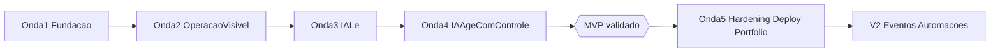

# Lean Inception — AI Business Operations Platform

> Documento de alinhamento do MVP. Consolida o [Discovery](./discovery.md) e o [PROJECT_PLAN](../PROJECT_PLAN.md) no formato Lean Inception (Paulo Caroli): visão, É/Não é/Faz/Não faz, objetivos, personas, jornadas, brainstorm de features, revisão técnica/negócio/UX, sequenciador e MVP Canvas.
>
> Status: **Aprovado para iniciar Fase 1 (Domain Design)**
> Owner: product-manager (agente) + Pedro (PO)
> Última revisão: 2026-09-09

---

## 0. Premissas do projeto

Decisões tomadas pelo PO antes desta inception, que restringem todo o restante do documento:

1. **Natureza:** projeto de portfólio de engenharia. Não há operação real de e-commerce para validar com usuários. Os dados são simulados por um seed determinístico e as hipóteses são validadas por cenários reproduzíveis e métricas simuladas.
2. **Equipe:** um desenvolvedor (Pedro) + agentes de IA no Cursor, cada um com um papel definido (ver [`.cursor/agents/`](../.cursor/agents/)). Isso limita o MVP ao que uma pessoa consegue construir com qualidade em ondas de ~2 semanas.
3. **Escrita pela IA no MVP:** exatamente duas ações de escrita: uma de baixo risco executada diretamente (`update_order_priority`) e uma de alto impacto que exige aprovação humana (`cancel_order`). Isso resolve o conflito entre o Discovery §10-11 (aprovação humana no MVP) e o PROJECT_PLAN §32 (aprovação humana em V2): **aprovação humana entra no MVP**, porque é ela que prova a tese do projeto (H2 e H4).
4. **Provedor de IA:** Anthropic Claude via Vercel AI SDK (`ai` + `@ai-sdk/anthropic`). O provedor fica atrás de uma abstração para permitir troca futura. Ver [ADR-005](./adr/005-ai-provider-anthropic.md).
5. **Princípio inegociável:** "Construir um sistema de negócio que utiliza IA como camada inteligente, e não uma aplicação de IA que possui um banco de dados." A IA nunca acessa o banco; só acessa tools explicitamente registradas. Ver [ADR-003](./adr/003-ai-tool-boundary.md).

---

## 1. Visão do produto

> **Para** operadores de pequenos e-commerces que perdem tempo cruzando pedidos, pagamentos e estoque em várias telas para descobrir o que precisa de atenção,
> **o** AI Business Operations Platform
> **é** um painel operacional com um assistente de IA
> **que** consulta os dados reais e executa ações operacionais por meio de ferramentas controladas, com auditoria completa.
> **Diferente de** um chatbot genérico plugado em um dashboard,
> **o nosso produto** mantém regras de negócio, autorização, auditoria e aprovação humana determinísticas dentro do sistema: a IA interpreta a intenção, o sistema continua sendo a fonte da verdade.

---

## 2. É / Não é / Faz / Não faz

### É
- Um sistema de operações de e-commerce (pedidos, clientes, produtos, estoque, pagamentos) com uma camada de IA por cima.
- Um monólito modular em Next.js + TypeScript + PostgreSQL.
- Uma prova de conceito de portfólio: demonstra engenharia, arquitetura e integração responsável de LLMs a sistemas de negócio.
- Single-tenant, para uma única operação.

### Não é
- Um chatbot genérico ou "ChatGPT com acesso ao banco".
- Um ERP ou plataforma completa de e-commerce (não tem checkout, catálogo público nem logística).
- Um produto multi-tenant/SaaS.
- Um aplicativo mobile.
- Um sistema de IA autônoma que toma decisões críticas sozinha.

### Faz
- Centraliza dados operacionais em um painel único.
- Identifica pedidos problemáticos com **regras determinísticas** (atraso, pagamento falho, estoque indisponível, aguardando pagamento há muito tempo).
- Responde perguntas em linguagem natural usando apenas dados reais obtidos por tools.
- Executa ações operacionais de baixo risco diretamente, com auditoria.
- Transforma ações de alto impacto em **propostas** que exigem aprovação humana antes da execução.
- Registra quem fez o quê, com qual ferramenta, com quais parâmetros e qual foi o resultado.

### Não faz (no MVP)
- Pagamentos reais (gateway) — simulados.
- Integrações externas (WhatsApp, marketplaces, transportadoras).
- Automações disparadas por eventos/filas (V2).
- Múltiplos agentes especializados (V3).
- RAG, fine-tuning, memória de longo prazo.
- Relatórios analíticos avançados.

---

## 3. Objetivos do produto

Ordenados por prioridade. Os três primeiros definem o MVP.

1. **Reduzir o tempo de triagem operacional:** o operador descobre o que precisa de atenção com uma pergunta, e não navegando em 4-5 telas. (Hipótese H1)
2. **Provar que IA pode agir em um sistema de negócio sem acesso irrestrito:** todas as leituras e escritas passam por tools com validação, autorização e auditoria. (Hipóteses H2 e H4)
3. **Manter o humano no controle das decisões críticas:** ações de alto impacto viram propostas aprovadas por uma pessoa. (Hipótese H4)
4. **Tornar as decisões da IA observáveis:** responder "por que o agente fez isso?" a partir do log de tool calls, tokens, latência e custo.
5. **Servir como peça de portfólio:** documentação de decisões (ADRs), trade-offs e resultados medidos.

---

## 4. Personas

### P1 — Marina, operadora de e-commerce (persona primária)

- **Perfil:** 29 anos, cuida sozinha da operação de uma loja online com ~300 pedidos/mês. Não tem perfil técnico. Usa planilhas, o painel da plataforma de e-commerce e o painel do gateway de pagamento.
- **Rotina:** começa o dia verificando pedidos parados, pagamentos recusados e produtos sem estoque. Responde clientes que perguntam "onde está meu pedido?".
- **Dor:** para saber se um pedido está com problema, precisa abrir 3-4 telas diferentes e cruzar informações de cabeça. Perde 1-2 horas por dia só em triagem. Erra prioridades porque não vê tudo junto.
- **Objetivo:** "Quero abrir uma tela e saber o que precisa da minha atenção hoje, e resolver ali mesmo."
- **Comportamento com IA:** confia se a resposta vier com o número do pedido e o motivo; desconfia de respostas vagas. Prefere perguntar em português a aprender filtros.

### P2 — Rafael, dono/gestor da operação (aprovador)

- **Perfil:** 38 anos, dono da loja. Olha a operação algumas vezes por dia, geralmente pelo celular ou entre reuniões.
- **Dor:** não quer que ninguém (nem a IA) cancele pedidos ou mexa em dinheiro sem ele saber. Quer visão consolidada, não detalhe.
- **Objetivo:** "Quero aprovar o que é crítico e ter rastro de tudo que aconteceu."
- **Comportamento com IA:** aceita que a IA proponha, mas quer ver o motivo e decidir. Vai perguntar "como foi a semana?" (jornada J3, pós-MVP).

### P3 — Avaliador técnico (audiência do portfólio)

- **Perfil:** tech lead, engenheiro sênior ou recrutador técnico avaliando o projeto.
- **Objetivo:** entender rapidamente a arquitetura, ver que a IA está isolada por tools, ver testes, ADRs e rastreabilidade ("por que o agente tomou essa ação?").
- **Implicação para o produto:** README claro, diagramas, tela de auditoria legível, golden set de avaliação da IA e demo reproduzível (seed).

---

## 5. Jornadas dos usuários

### J1 — Triagem matinal (Marina) — **MVP, jornada principal**

1. Marina faz login e vê o dashboard: total de pedidos, pagamentos falhos, itens com estoque baixo, alertas.
2. Abre o assistente e pergunta: **"Quais pedidos precisam de atenção?"**
3. A IA chama `get_orders_needing_attention`, que aplica as regras determinísticas e retorna uma lista estruturada.
4. A IA responde em português, listando cada pedido com o motivo (ex.: `#1023` pagamento recusado 3 vezes; `#1044` aguardando pagamento há 48h; `#1088` atrasado 2 dias; `#1091` produto sem estoque).
5. Marina clica em `#1088` e vê o detalhe (cliente, itens, pagamento, estoque, histórico).
6. Marina diz: **"Marque o pedido #1088 como prioridade."**
7. A IA chama `update_order_priority`; o sistema valida autorização e regra de negócio, atualiza e registra no audit log.
8. A IA confirma. O detalhe do pedido mostra a prioridade e o registro de auditoria.

**Hoje, sem o produto:** abrir painel da loja → filtrar pedidos → abrir cada pedido → abrir painel do gateway → conferir pagamento → abrir estoque → decidir. Estimativa: 15-25 cliques e 4 telas para chegar à mesma lista.

### J2 — Investigação e ação crítica (Marina + Rafael) — **MVP**

1. Um cliente reclama. Marina pergunta: **"Me mostre o pedido #1023."**
2. A IA chama `get_order` e apresenta cliente, itens, valor, status, pagamentos e histórico.
3. Marina vê que o pagamento foi recusado 3 vezes e pergunta: **"O que você sugere?"**
4. A IA propõe cancelar o pedido e explica o motivo. Como `cancel_order` é uma ação de alto impacto, a IA chama `propose_action`, que cria uma **ação pendente** (não executa).
5. Rafael (ADMIN) vê a ação pendente na tela de aprovações, lê o motivo e aprova.
6. O sistema executa `cancel_order` via service, valida a transição de estado e registra no audit log quem propôs, quem aprovou e o resultado.
7. Marina vê o pedido cancelado e o histórico completo.

### J3 — Revisão semanal (Rafael) — **pós-MVP (onda 5+)**

1. Rafael pergunta: **"Analise os pedidos desta semana."**
2. A IA usa tools de agregação (`get_orders_summary`) e retorna quantidade, pagos, pendentes, cancelados, recusas, produtos mais vendidos e problemas.

---

## 6. Brainstorm de features

Agrupadas por objetivo. O código entre colchetes identifica a feature no sequenciador e no [roadmap](./roadmap.md).

### Fundação
- [F01] Setup do projeto: Next.js, TypeScript, Prisma, PostgreSQL em Docker, lint, testes.
- [F02] Autenticação: login com credenciais, sessão, papéis `OPERATOR` e `ADMIN`.
- [F03] Seed determinístico com cenários fixos (pedidos `#1023`, `#1044`, `#1088`, `#1091`) e volume realista.
- [F04] Layout base da aplicação (navegação, shell, estados de loading/erro).

### Operação visível (sem IA)
- [F05] Pedidos: listagem com filtros, detalhe, status, prioridade, itens, pagamentos.
- [F06] Clientes: listagem, detalhe, histórico de pedidos.
- [F07] Produtos e estoque: catálogo, preço, categoria, quantidade disponível.
- [F08] Pagamentos: status, histórico, falhas.
- [F09] Dashboard com resumo e alertas por regras determinísticas.
- [F10] Motor de regras "pedidos que precisam de atenção" (service reutilizado pela UI e pelas tools).

### IA lê
- [F11] Chat do assistente (UI + streaming).
- [F12] Tool registry: contrato (nome, descrição, schema de input/output, autorização, auditoria) e registro explícito das tools.
- [F13] Tools de leitura: `get_order`, `get_orders_needing_attention`, `get_customer`, `search_products`, `get_low_stock_products`, `get_failed_payments`.
- [F14] Audit log de tool calls (usuário, tool, parâmetros, resultado, timestamp, tokens, latência).
- [F15] Observabilidade básica da IA: latência, tokens, custo estimado por interação.

### IA age com controle
- [F16] Tool de escrita direta: `update_order_priority`.
- [F17] Human-in-the-loop: `propose_action` → ação pendente → aprovação por ADMIN → execução de `cancel_order`.
- [F18] Tela de aprovações pendentes.
- [F19] Tela de auditoria (linha do tempo de ações).
- [F20] Golden set de avaliação da IA (~20 perguntas → tool esperada + asserções) e script de eval.

### Hardening, deploy e portfólio
- [F21] Testes E2E das jornadas J1 e J2.
- [F22] Docker (app) + CI (lint, testes, build).
- [F23] Deploy em cloud com variáveis de ambiente e monitoramento básico.
- [F24] README, diagramas, demo reproduzível, registro de resultados.

### Pós-MVP (registradas, não sequenciadas)
- Análise semanal (`get_orders_summary`) — J3.
- Eventos de domínio (`OrderCreated`, `PaymentFailed`, `InventoryLow`...) e filas.
- Automações (trigger → condição → análise → ação).
- Notificações ao operador.
- Múltiplos agentes especializados.
- Notas internas no pedido via IA (`add_order_note`).

---

## 7. Revisão técnica, de negócio e UX

Escala: esforço **P/M/G**, valor de negócio **Alto/Médio/Baixo**, incerteza técnica **Alta/Média/Baixa**.

- **F01 Setup** — esforço M, valor Baixo (habilitador), incerteza Baixa.
- **F02 Auth + papéis** — esforço M, valor Médio (habilita autorização das tools e o aprovador), incerteza Baixa.
- **F03 Seed determinístico** — esforço M, valor Alto (demo reproduzível, base do golden set), incerteza Baixa.
- **F04 Layout base** — esforço P, valor Baixo, incerteza Baixa.
- **F05 Pedidos** — esforço G, valor Alto (centro do domínio), incerteza Baixa.
- **F06 Clientes** — esforço P, valor Médio, incerteza Baixa.
- **F07 Produtos + estoque** — esforço M, valor Médio, incerteza Baixa.
- **F08 Pagamentos** — esforço M, valor Alto (fonte principal de problemas), incerteza Baixa.
- **F09 Dashboard** — esforço M, valor Alto, incerteza Baixa.
- **F10 Motor de regras de atenção** — esforço M, valor Alto (é a inteligência determinística), incerteza Média (definição das regras e SLAs).
- **F11 Chat** — esforço M, valor Alto, incerteza Média (streaming + tool calling na UI).
- **F12 Tool registry** — esforço M, valor Alto (é a fronteira de segurança), incerteza Média.
- **F13 Tools de leitura** — esforço M, valor Alto, incerteza Média (qualidade das descrições para seleção correta).
- **F14 Audit de tool calls** — esforço P, valor Alto, incerteza Baixa.
- **F15 Observabilidade IA** — esforço P, valor Médio, incerteza Baixa.
- **F16 update_order_priority** — esforço P, valor Alto (primeira escrita), incerteza Baixa.
- **F17 Human-in-the-loop** — esforço G, valor Alto (tese do projeto), incerteza **Alta** (modelagem da ação pendente, idempotência, expiração).
- **F18 Tela de aprovações** — esforço P, valor Alto, incerteza Baixa.
- **F19 Tela de auditoria** — esforço P, valor Médio (P3), incerteza Baixa.
- **F20 Golden set / eval** — esforço M, valor Alto (como sabemos que funciona), incerteza **Alta** (métrica de correção de respostas em linguagem natural).
- **F21 E2E** — esforço M, valor Médio, incerteza Baixa.
- **F22 Docker + CI** — esforço P, valor Médio, incerteza Baixa.
- **F23 Deploy** — esforço M, valor Médio, incerteza Média (custo/provider).
- **F24 Portfólio** — esforço M, valor Alto (P3), incerteza Baixa.

Observações da revisão:
- A UX de J1 depende de a resposta da IA ser **estruturada e verificável** (número do pedido + motivo + link). Isso é requisito de F11/F13, não detalhe visual.
- F10 deve ser um service único consumido pela UI (F09) e pela tool (F13). Evita duas definições de "problema".
- F17 é a única feature de alta incerteza que entra no MVP, e fica isolada na onda 4 junto de F20 (que valida F17). As regras do sequenciador permitem no máximo uma feature de alta incerteza por onda; F17 e F20 são ambas Altas, então F20 começa em formato reduzido (golden set de leitura) na onda 3 e é completado na onda 4.

---

## 8. Sequenciador

Regras adotadas (Lean Inception): cada onda tem no máximo 3 "cartões grandes" (features G ou agrupamentos), pelo menos 1 de alto valor, no máximo 1 de alta incerteza, e cada onda deve entregar algo demonstrável.

### Onda 1 — Fundação
- F01 Setup, F02 Auth + papéis, F03 Seed, F04 Layout base.
- **Demonstrável:** login, banco populado com os cenários do discovery, shell da aplicação.
- Fases do PROJECT_PLAN: 1 (Domain), 2 (Architecture) e 3 (Foundation). As Fases 1 e 2 produzem `docs/domain.md` e `docs/architecture.md` **antes** do código.

### Onda 2 — Operação visível (sem IA)
- F05 Pedidos, F06 Clientes, F07 Produtos + estoque, F08 Pagamentos, F09 Dashboard, F10 Motor de regras.
- **Demonstrável:** Marina vê a operação e os alertas sem precisar da IA. Isso valida que o valor vem dos dados e das regras, e a IA é interface.
- Fase 4 (Core Business).

### Onda 3 — IA lê
- F11 Chat, F12 Tool registry, F13 Tools de leitura, F14 Audit de tool calls, F15 Observabilidade, F20 (parcial: golden set de leitura).
- **Demonstrável:** J1 até o passo 5 e J2 até o passo 3. Toda resposta rastreável no audit.
- Fase 5 (AI).

### Onda 4 — IA age com controle
- F16 `update_order_priority`, F17 Human-in-the-loop (`propose_action` → `cancel_order`), F18 Tela de aprovações, F19 Tela de auditoria, F20 (completo).
- **Demonstrável:** J1 e J2 completas. Critério de sucesso do MVP ([Discovery §15](./discovery.md)) atingido.
- Fase 5 (AI) + parte da Fase 7 (idempotência, tratamento de erros de HITL).

### Onda 5 — Hardening, deploy e portfólio (pós-MVP)
- F21 E2E, F22 Docker + CI, F23 Deploy, F24 Portfólio.
- Fases 7, 8 e 9.

**MVP = Ondas 1 a 4.**

---

## 9. MVP Canvas

### Proposta do MVP
Um painel operacional de e-commerce onde a operadora pergunta em português "o que precisa de atenção?", recebe uma lista baseada em regras determinísticas e dados reais, marca prioridades diretamente e delega ao gestor a aprovação de cancelamentos propostos pela IA, com tudo auditado.

### Segmento de personas
- Primária: P1 Marina (operadora).
- Aprovadora: P2 Rafael (gestor/ADMIN).
- Audiência do portfólio: P3 Avaliador técnico.

### Jornadas
- J1 Triagem matinal (completa).
- J2 Investigação e ação crítica (completa).

### Features
- Ondas 1 a 4: F01 a F20.

### Resultado esperado
- H1 confirmada se a lista de pedidos problemáticos é obtida com 1 pergunta em vez de ~4 telas.
- H2 confirmada se 100% das operações da IA passam por tools registradas, sem acesso direto a dados.
- H3 parcialmente confirmada se J1 e J2 são executadas ponta a ponta via assistente.
- H4 confirmada se nenhuma ação de alto impacto é executada sem aprovação humana e a regra que decide "problema" é determinística e testada.

### Métricas para validar as hipóteses
Baselines simuladas (medidas no seed com a UI sem IA vs. com IA):
- Passos (cliques/telas) para obter a lista de pedidos problemáticos: alvo <= 2 com IA vs. >= 10 manual.
- Tempo para localizar um pedido e entender o problema: alvo < 30s com IA.
- Taxa de sucesso de tool calls (tool correta escolhida no golden set): alvo >= 90%.
- Respostas com afirmação não suportada pelos dados (alucinação) no golden set: alvo 0.
- Ações de alto impacto executadas sem aprovação: obrigatoriamente 0.
- Latência p95 por interação: alvo < 8s. Custo médio por interação: registrado e reportado.
- Cobertura de testes das regras de negócio e das tools: alvo >= 80%.

### Custo e cronograma
- Equipe: 1 dev + agentes de IA.
- Ritmo estimado: ~2 semanas por onda em tempo parcial. MVP (ondas 1-4) em ~8 semanas. Estimativa, não compromisso; revisada ao fim de cada onda.
- Custos diretos: API Anthropic em dev (Haiku) e demo (Sonnet), infra gratuita/low-cost (Vercel + Neon) na onda 5.

---

## 10. Respostas às perguntas abertas do Discovery (§16)

| Pergunta | Decisão | Registro |
|---|---|---|
| Qual banco de dados? | PostgreSQL 16 em Docker + Prisma ORM. | [ADR-002](./adr/002-postgresql-prisma.md) |
| Qual provedor/modelo de IA? | Anthropic Claude via Vercel AI SDK. Haiku em dev/testes; Sonnet em demo. Provider abstraído. | [ADR-005](./adr/005-ai-provider-anthropic.md) |
| Qual estratégia de autenticação? | Auth.js (credentials) + sessão. Enum `Role { OPERATOR, ADMIN }` no `User`, checado na camada de autorização das tools e das rotas. | [ADR-004](./adr/004-authentication-and-roles.md) |
| Como representar os estados dos pedidos? | Proposta para `domain.md`: `PENDING_PAYMENT → PAID → PROCESSING → SHIPPED → DELIVERED`; `CANCELLED` terminal (permitido a partir de `PENDING_PAYMENT`, `PAID`, `PROCESSING`). Pagamento: `PENDING | FAILED | PAID | REFUNDED`. Regras de atenção: aguardando pagamento > 48h; >= 3 falhas de pagamento; envio atrasado além do SLA (`expectedShipDate`); item sem estoque disponível. | `docs/domain.md` (Fase 1) |
| Quais ações exigem aprovação? | Leitura: nenhuma. Escrita de baixo risco (prioridade, nota interna): execução direta + audit. Escrita de alto impacto (cancelar, reembolsar, alterar status): proposta + aprovação de ADMIN. | [ADR-006](./adr/006-human-in-the-loop-policy.md) |
| Quais tools existirão inicialmente? | Leitura: `get_order`, `get_orders_needing_attention`, `get_customer`, `search_products`, `get_low_stock_products`, `get_failed_payments`. Escrita: `update_order_priority` (direta), `propose_action` (cria pendência; `cancel_order` só executa após aprovação). | Este documento §6 + [ADR-003](./adr/003-ai-tool-boundary.md) |
| Como será feito o seed? | `prisma/seed.ts` determinístico: faker com seed fixo para volume + cenários explícitos (`#1023`, `#1044`, `#1088`, `#1091`) que ancoram demo e golden set. Usuários `marina@demo` (OPERATOR) e `rafael@demo` (ADMIN). | Roadmap F03 |
| Como serão avaliadas as respostas da IA? | Golden set versionado (`tests/eval/golden-set.json`): pergunta → tool(s) esperada(s) → asserções sobre a resposta (ex.: contém `#1023`). Roda como teste de integração com LLM mockado e como script de eval com LLM real, reportando taxa de acerto, latência e custo. | Roadmap F20 |
| Onde o sistema será hospedado? | Recomendação: Vercel (app) + Neon (Postgres). Decisão final na Fase 8, em ADR futuro. | ADR futuro (onda 5) |

---

## 11. Riscos e mitigações

- **IA escolhe a tool errada ou inventa dados** → descrições de tools precisas, respostas sempre ancoradas em IDs, golden set (F20), system prompt que proíbe afirmar o que não veio de tool.
- **Complexidade do human-in-the-loop (F17)** → modelar `AIAction` com estados `PROPOSED → APPROVED → EXECUTED | REJECTED | FAILED | EXPIRED`, execução idempotente, isolado na onda 4.
- **Escopo crescer (multi-agente, eventos, integrações)** → lista explícita de "Não faz"; qualquer adição exige ADR e aprovação do PO.
- **Custo de API em dev** → Haiku em dev, LLM mockado nos testes, limites de tokens por interação.
- **Prompt injection via dados (ex.: nome de cliente com instruções)** → dados de tools tratados como conteúdo, não instruções; escrita sempre via tools com autorização; revisão do security-engineer na onda 3.
- **Dev solo perde ritmo** → ondas com entregável demonstrável; ao fim de cada onda, revisar este documento e o roadmap.

---

## 12. Próximos passos

1. Fase 1 — `docs/domain.md` (owner: solution-architect): entidades, relacionamentos, máquina de estados de pedido/pagamento/ação, regras de atenção, eventos futuros.
2. Fase 2 — `docs/architecture.md` (owner: solution-architect): confirmar/ajustar ADRs 001-006, estrutura de módulos, contratos de tools, segurança, observabilidade.
3. Aprovação do PO.
4. Onda 1 (owner: software-engineer, com qa-engineer e security-engineer).
